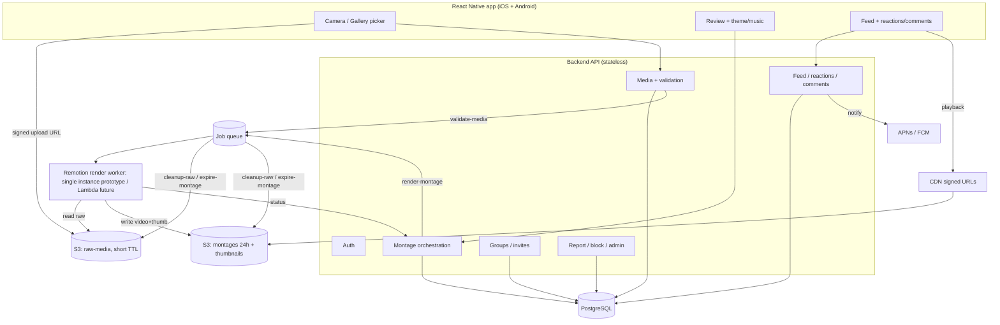
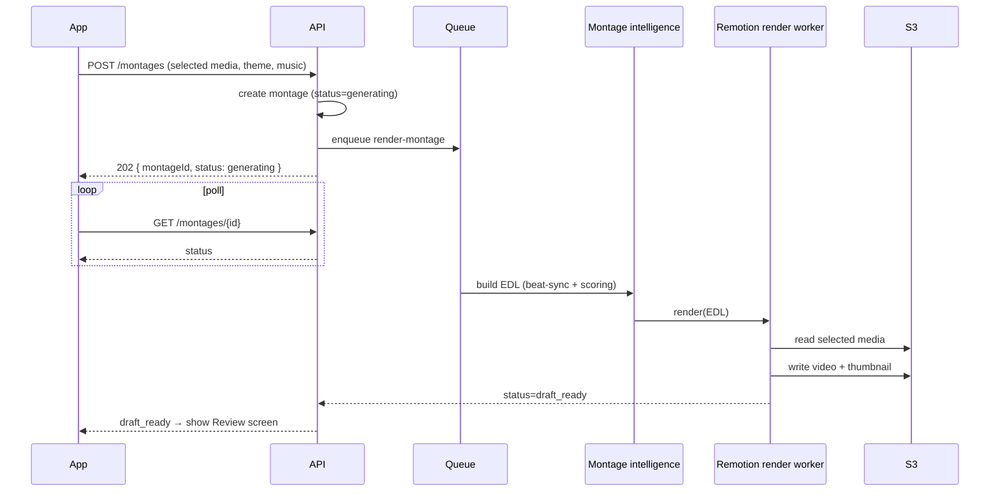

# twenty4 — Development Specification (MVP)

**Status:** Draft v1 for engineering
**Audience:** In-house build team (decisions + contracts provided; implementation detail left to the team where noted)
**Source of truth:** This document resolves and supersedes open questions in the PRD. Where this spec and the PRD disagree, **this spec wins**. The PRD remains the reference for product rationale.

---

## 0. How to read this document

This spec is organized so a backend, mobile, and infra engineer can each find their contract:

- **§1–3** — what we're building, the locked decisions, and the stack. Read first.
- **§4–7** — architecture, data model, lifecycle, and the montage pipeline (the hard part).
- **§8–9** — API surface and screen inventory (including **design gaps that block build**).
- **§10–13** — non-functional targets, security/privacy, analytics, and the items still needing a founder/business decision.
- **§14** — build phasing.

Decisions are marked **[DECIDED]**. Things the team owns are marked **[TEAM]**. Things still blocked on a business/founder decision are marked **[NEEDS DECISION]** and collected in §13.

---

## 1. Product scope (MVP boundary)

twenty4 is a mobile app for **private friend groups**. Each user collects photos/videos from the **current day**, the app auto-generates a **30-second 9:16 montage**, the user reviews and publishes it to selected groups, friends react/comment, and **all content is deleted from the server after 24 hours.**

**In scope (MVP):** auth/onboarding, private groups, today-only media bucket with metadata validation, server-side montage generation, themes + licensed music, review/publish, chronological feed, reactions/comments, owner download, 24h expiry + deletion jobs, report/block, profile/settings, a minimal admin/moderation surface.

**Explicitly out (MVP):** public profiles, public discovery, followers outside groups, manual timeline editing, AI highlight detection, monetization/ads, permanent archive, web app, brand accounts, streaks/gamification.

---

## 2. Locked decisions (resolves PRD §24 open questions)

These were open in the PRD. They are now decided so the team can build without ambiguity. Rationale is short; override only with a written change to this section.

| # | Question | **Decision** | Rationale |
|---|----------|-------------|-----------|
| Q1 | Publish one montage to multiple groups? | **[DECIDED] Yes.** One render, multiple visibility rows. | Cheap (single render), matches the "share with my circles" intent. |
| Q2 | Replace a published recap before expiry? | **[DECIDED] Yes, replace allowed.** Replacing hard-deletes the previous montage **and its reactions/comments**, then publishes the new one. | Avoids stale reactions attached to changed content; keeps "one live recap per group per day." |
| Q3 | Daily cutoff window | **[DECIDED] 4:00 AM → 4:00 AM, user's local timezone.** Store all timestamps in UTC; compute the day-window per device tz with a +4h offset. | Late-night captures belong to "today" for a social recap app. |
| Q4 | Block gallery uploads with missing metadata? | **[DECIDED] Reject only when no reliable timestamp exists at all.** Accept if any source in the validation hierarchy (§6) resolves to today. | Hard "missing-metadata = reject" over-blocks legitimate HEIC/edited photos. |
| Q5 | When is raw media deleted after publish? | **[DECIDED] 60-minute grace window, then delete.** Unpublished raw media is purged at the day-window close. | Allows replace/re-render and failure recovery without a permanent archive. |
| Q6 | Comments/reactions retention | **[DECIDED] Fully deleted on expiry.** Retain only anonymized aggregate counts for analytics (no text, no user linkage). | Honors "temporary by default." |
| Q7 | Download permissions | **[DECIDED] Owner downloads own montage (draft + published). No downloading others'.** | Matches privacy promise. |
| Q8 | Music: app-provided only for MVP? | **[DECIDED] Yes — licensed app library only. No user audio uploads.** | Removes the largest store-approval/legal risk. Source is **[NEEDS DECISION]** — see §13. |
| Q9 | Where does montage generation run? | **[DECIDED] Server-side, via Remotion on a single self-hosted render worker** (`@remotion/renderer`, one instance — **not** Lambda). Not on-device. Remotion **Lambda** deferred to future for autoscaling (§7.2). | Consistent output, server-controlled themes; Remotion's React compositions match the stack; single instance keeps prototype infra minimal. |
| Q10 | Max acceptable processing time | **[DECIDED] Target p50 < 60s, p95 < 120s for ≤50 items → 30s output. Hard timeout 5 min → fail + retry once.** | Sets a testable SLO for the render pipeline. |
| Q11 | Invite links expire? | **[DECIDED] Yes — expire after 7 days OR 25 uses, owner-revocable.** | Abuse prevention (PRD §18). |
| Q12 | Group admins beyond creator? | **[DECIDED] MVP: owner-only management.** Keep a `role` enum (owner/admin/member) for future; only `owner` has admin powers in MVP. | Simpler; schema stays forward-compatible. |
| Q13 | Multiple daily recaps? | **[DECIDED] No. One recap per user per group per day.** | Matches the product loop. |
| Q14 | Streaks / gamification? | **[DECIDED] None in MVP.** Capture/generate reminders only. | Streaks are roadmap, not MVP. |
| Q15 | Is deletion restorable? | **[DECIDED] No — hard delete, permanent.** A metadata-only tombstone is kept for audit (never content). | Core privacy promise. |

**Stack decisions (from kickoff):**

- **[DECIDED] Mobile client:** Cross-platform — **React Native** (one codebase; also keeps a shared React mental-model open for the Remotion render path if/when that future enhancement is adopted).
- **[DECIDED] Montage engine:** **algorithmic beat-synced "smart" editing** (no ML) produces an EDL, which is rendered by **Remotion on a single self-hosted render worker** (`@remotion/renderer`, not Lambda) for the prototype, behind a swappable renderer interface. **Remotion Lambda is a documented future enhancement** for autoscaling (§7).
- **[DECIDED] Auth:** **own auth layer** — **Better Auth** recommended (sessions in our Postgres, immediate revocation, OAuth + OTP plugins, framework-agnostic), **Passport.js** as the familiar fallback. Not a managed provider.
- **[DECIDED] Object storage:** **S3-compatible** (AWS S3, Cloudflare R2, MinIO, etc.) with lifecycle rules + signed URLs.
- **[DECIDED] Job queue:** **BullMQ** (Redis-backed).
- **[DECIDED] Spec posture:** In-house team — firm decisions + interface contracts + acceptance criteria; implementation detail is the team's call.

---

## 3. Technology stack

| Layer | Choice | Notes |
|-------|--------|-------|
| Mobile client | **React Native** (latest stable RN; **[TEAM]** Expo vs bare — bare recommended for native camera/video + background upload control) | Needs native modules for camera, media-library metadata, background upload, push, save-to-gallery. |
| Backend API | **[TEAM]** team's strongest stack (Node/TypeScript recommended — aligns with Remotion + Better Auth; Go/Python also fine for the API). Remotion rendering + audio analysis run in the render worker, not the API. | Stateless REST/JSON. Auth-gated. |
| Auth | **Own auth layer — Better Auth** (recommended) or **Passport.js** (fallback): phone OTP, email, Apple, Google. Sessions/tokens in our Postgres. | Apple Sign-In is **mandatory** if any other social login ships (App Store rule). Own-your-data; immediate session revocation supports suspend/ban + account-deletion flows. |
| Database | **PostgreSQL** | Relational fits the entity graph; supports partial indexes for active-content queries. |
| Object storage | **S3-compatible** (AWS S3 / R2 / MinIO) with lifecycle rules + signed URLs | Buckets: `raw-media` (private, short TTL), `montages` (private, 24h TTL), `thumbnails`. No public-read. |
| CDN | CloudFront (or compatible) over the montage/thumbnail buckets, signed URLs only | Fast feed playback. |
| Render | **Prototype:** Remotion on a single self-hosted render worker (`@remotion/renderer`, queue-fed). **Future:** Remotion Lambda for autoscaling. | Renders a Remotion composition parameterized by the EDL. Carries a Remotion **Company License** once the company exceeds 3 people (§7.2). |
| Audio analysis | **[TEAM]** beat/tempo detection lib (aubio/librosa-class, server-side) | Drives beat-synced cutting (§7.1). |
| Job queue | **BullMQ** (Redis-backed) | Jobs: validate-media, render-montage, cleanup-raw, expire-montage, dispatch-notification, retry. |
| Push | APNs + FCM via a dispatcher (**[TEAM]** e.g. FCM for both, or provider) | Reminders + interaction notifications. |
| Analytics | **[TEAM]** product analytics SDK (events in §12) | Event schema is fixed; vendor is the team's call. |
| Admin panel | Lightweight internal web app (**[TEAM]**) | Moderation + ops only; not customer-facing. |

---

## 4. System architecture



**Key principles baked into the architecture:**

- **No public media URLs, ever.** All reads/writes go through short-lived signed URLs; server authorizes every request against group membership (PRD §18).
- **Rendering is async and out-of-band.** The API never blocks on a render; it enqueues and the client polls/subscribes to montage status.
- **Storage TTL is enforced in two layers:** S3 lifecycle rules *and* application cleanup jobs (belt and suspenders, since the 24h promise is the product).

---

## 5. Data model

Core entities (refined from PRD §12 with types, keys, and lifecycle fields). PostgreSQL types suggested; **[TEAM]** owns final DDL, indexes, and migrations.

**Conventions:** all IDs are UUID v4. All timestamps stored UTC (`timestamptz`). Soft-delete is **not** used for content — deletion is hard (§6); only `report` and an `audit_log` keep tombstones.

### user
`id` PK · `display_name` · `username` (unique, citext) · `profile_photo_url` · `email` (nullable) · `phone` (nullable) · `auth_provider` enum(phone,email,apple,google) · `account_status` enum(active,suspended,banned,deleted) · `notification_prefs` jsonb · `privacy_settings` jsonb · `created_at`
*Constraint:* at least one of email/phone present.

### group
`id` PK · `name` · `photo_url` · `owner_id` FK→user · `status` enum(active,archived) · `created_at`

### group_invite
`id` PK · `group_id` FK · `code` (unique, short, URL-safe) · `created_by` FK→user · `expires_at` · `max_uses` (default 25) · `use_count` · `revoked_at` (nullable)
*Rule:* invalid if `revoked_at` set, `now > expires_at`, or `use_count >= max_uses` (Q11).

### group_member
`group_id` FK · `user_id` FK · `role` enum(owner,admin,member) · `joined_at` · `status` enum(active,left,removed) · PK(`group_id`,`user_id`)
*MVP:* only `owner` exercises admin powers (Q12).

### daily_media_item
`id` PK · `user_id` FK · `day_bucket` date (the 4am-window local day, Q3) · `media_type` enum(photo,video) · `storage_path` · `original_timestamp` (nullable) · `upload_timestamp` · `validation_status` enum(pending,valid,invalid) · `processing_status` enum(uploaded,validating,valid,invalid,used,deleted,failed) · `duration_ms` (nullable) · `metadata_summary` jsonb · `expiry_at`
*Index:* (`user_id`,`day_bucket`,`validation_status`).

### montage
`id` PK · `user_id` FK · `day_bucket` date · `video_path` (nullable until rendered) · `thumbnail_path` (nullable) · `duration_ms` · `status` enum(not_generated,generating,draft_ready,published,failed,deleted_by_user,removed_by_admin,expired) · `theme` · `music_id` · `render_job_id` (nullable) · `created_at` · `published_at` (nullable) · `expiry_at` (nullable, = published_at + 24h)
*Index:* partial index on (`status`,`expiry_at`) where status in (published) — drives feed + expiry sweeps.

### montage_group_visibility
`montage_id` FK · `group_id` FK · PK(`montage_id`,`group_id`)
*Drives:* "one render → many groups" (Q1) and per-group feed authorization.

### reaction
`id` PK · `montage_id` FK · `user_id` FK · `type` enum(like,laugh,fire,heart,shocked) · `created_at` · unique(`montage_id`,`user_id`) → one reaction per user per montage (replaceable).

### comment
`id` PK · `montage_id` FK · `user_id` FK · `text` · `created_at` · `status` enum(active,deleted)

### report
`id` PK · `reporter_id` FK · `target_type` enum(montage,comment,user) · `target_id` · `reason` · `status` enum(open,under_review,actioned,dismissed) · `admin_action` (nullable) · `created_at`
*Note:* may retain a content snapshot for moderation review even after the montage expires, where legally appropriate (PRD §11.12). **[NEEDS DECISION]** retention duration — see §13.

### block
`id` PK · `blocker_id` FK · `blocked_id` FK · `created_at` · unique(`blocker_id`,`blocked_id`)

### audit_log
`id` PK · `actor_id` · `action` · `target_type` · `target_id` · `metadata` jsonb · `created_at` — admin/moderation/deletion actions only.

---

## 6. Data lifecycle & deletion semantics (the core promise)

This is the single most important behavioral contract in the app. Implement it precisely and add automated tests around each transition.

### Day window (Q3)
A media item belongs to `day_bucket` = the local calendar day under a **4:00 AM → 4:00 AM** window in the **device timezone at capture/upload time**. Example: a clip captured at 1:30 AM local on the 12th belongs to `day_bucket = the 11th`. Persist the resolved `day_bucket` on the row; do not recompute from UTC at read time.

### Raw media lifecycle
| Trigger | Action |
|---------|--------|
| Captured in-app | Auto-valid for current `day_bucket`. |
| Uploaded from gallery | Enters `pending` → validation job (hierarchy below) → `valid`/`invalid`. |
| User removes item | Hard-delete row + S3 object immediately. |
| Montage published successfully | **All** raw media for that `day_bucket` (used + unused) + draft renders deleted **after a 60-minute grace window** (Q5). |
| Day window closes without publish | Cleanup job purges that day's raw media. |
| Account deleted | All raw media purged immediately. |

### Metadata validation hierarchy (gallery uploads, Q4)
Resolve `original_timestamp` from the first available source, then check it falls in today's window:
1. EXIF `DateTimeOriginal`
2. Device media-library creation timestamp
3. File creation timestamp
4. **If none resolve → reject** (`validation_status=invalid`).
Anti-tamper: compare device-reported time against server time on upload; flag suspicious deltas for review (PRD §11.3 edge cases). Reject if resolved timestamp is outside today's window.

### Montage lifecycle
`not_generated → generating → draft_ready → published → expired`
with side-branches `→ failed` (render error), `→ deleted_by_user`, `→ removed_by_admin`.
- `published_at` set on publish; `expiry_at = published_at + 24h`.
- **Replace before expiry (Q2):** new render created; on its successful publish, the previous montage + its reactions/comments are hard-deleted.

### Montage deletion triggers
24h expiry reached · user manual delete · account deletion · admin removal. On any: delete video + thumbnail from S3, delete `montage` row, **cascade-delete its reactions and comments** (Q6), and write an `audit_log` tombstone (no content).

### Comments/reactions
Live and die with their montage. On expiry/delete, hard-delete. Only anonymized aggregate counts (e.g. "montage had N reactions") may persist in analytics — never text, never user linkage (Q6).

### Enforcement (defense in depth)
1. **S3 lifecycle rules** auto-expire objects (`raw-media` short TTL; `montages` ~25h safety TTL).
2. **Application cleanup jobs** run on a schedule and on triggers, and are the authoritative deletion path (they also clean DB rows + emit audit logs).
3. **Signed-URL expiry** ≤ remaining content lifetime, so a leaked URL dies with the content.

**Acceptance criteria (must have automated tests):** raw media gone after publish+grace; montage + reactions + comments gone at expiry; expired/deleted content returns 404 via old signed URLs; deletion jobs are logged; account deletion purges all active content within the cleanup SLA.

---

## 7. Montage pipeline — the core experience

The montage is what makes twenty4 feel "magic": the user picks clips, the app **mixes and matches them to the chosen music** and returns a finished 30-second cut they didn't have to edit. This section splits cleanly into **(a) the montage *intelligence*** (how clips are selected, ordered, and synced to the music) and **(b) the *renderer*** (what stitches the final video file). They are deliberately decoupled so each can evolve independently.

### 7.1 Montage intelligence — "smart / beat-synced" editing (prototype target)
This is the layer that produces the AI-like feel. For the prototype it is **algorithmic, not ML** — it gets ~90% of the perceived "AI" effect without models, training data, or inference cost.

Pipeline, run per generation request:
1. **Analyze the chosen track.** Run beat/tempo detection on the selected music to get a beat grid and (optionally) energy/drop points. **[TEAM]** beat-detection lib (e.g. an `aubio`/`librosa`-class tool server-side, or an audio-analysis package).
2. **Score the selected clips.** Cheap per-clip heuristics to find the better moments: motion/activity, sharpness (reject blur), face presence, brightness. Photos get a flat score. This is what lets the app "pick the good bits" rather than dumb chronological trimming.
3. **Mix & match to the beat.** Allocate the 30s timeline across the selected media, cutting **on the beat** — higher-energy track sections get faster cuts, calmer sections get longer holds. Trim each video to a beat-aligned segment around its highest-scoring moment; hold photos for a beat-length window. Default ordering chronological, but the beat grid (not fixed 1–3s rules) drives durations.
4. **Apply theme styling.** Theme (Chill, Party, Clean, Travel, Random, Fast Cut, Soft) sets the transition style, cut density bias, and any text/overlay treatment.
5. **Emit an edit decision list (EDL)** — an ordered list of `{mediaRef, inPoint, outPoint, transition, overlay}` plus the audio track. The renderer (7.3) consumes this; the renderer never makes creative decisions.

```
EditDecisionList {
  durationMs: 30000, aspect: "9:16", musicId,
  segments: [ { mediaRef, inMs, outMs, transition, overlay? }, ... ]
}
```

**Dial for later (not in prototype):** swap step 2's heuristics for an ML highlight-detection model, and/or use a model to choose pacing. The EDL contract stays identical, so this is an internal upgrade — flagged in §13 as a turn-up-later option.

### 7.2 Renderer abstraction
The intelligence layer outputs an EDL; a `Renderer` turns the EDL into an MP4. One interface, swappable implementation:
```
Renderer.render(EditDecisionList) -> { videoPath, thumbnailPath, durationMs, status }
```

- **Prototype implementation [DECIDED]:** **Remotion on a single self-hosted render worker** — a Remotion composition (the montage template) parameterized by the EDL props, rendered with `@remotion/renderer` (`renderMedia`) on one queue-fed instance. No Lambda/autoscaling. The EDL is the input contract: the composition reads `segments`, `musicId`, `theme` as props and produces the 9:16/30s MP4 + thumbnail.
- **Future enhancement (deferred): Remotion Lambda.** Same compositions, swapped to `renderMediaOnLambda` for serverless autoscaling under load. Slots behind the same interface; no rewrite.
- **Licensing note:** because the prototype *does* use Remotion, the **Company License** applies once the company exceeds 3 people (~$100/mo min, mandatory render telemetry from v5.0). A team of ≤3 is free. Track it as a small recurring cost (§13).

### 7.3 Render flow


### 7.4 Failure handling
On render error → `status=failed`, retry **once** automatically; on second failure surface a retryable error state to the user (design gap — see §9). Hard timeout 5 min (Q10). Failed renders never leave orphaned S3 objects (cleanup on failure).

### 7.5 Prototype validation **[TEAM]**
Before building the full flow, validate the intelligence + single-instance Remotion render on **50 mixed photos/videos + one track**: confirm the output is beat-synced, watchable, 9:16/30s, and renders within the §10 time target on one worker. Gate on render *time* and *output quality* (there's no Lambda per-render cost to measure at this stage).

---

## 8. API surface

REST/JSON, all endpoints auth-gated unless noted. Server authorizes every media/feed request against group membership and block relationships. **[TEAM]** owns exact payloads, pagination cursors, and error envelopes; the resource map below is the contract.

**Auth & onboarding:** `POST /auth/start` (phone/email/social) · `POST /auth/verify` (OTP) · `POST /auth/refresh` · `POST /auth/logout` · `POST /users` (create profile) · `PATCH /users/me` · `DELETE /users/me` (account deletion → triggers purge) · `POST /users/me/contacts-discovery` (opt-in).

**Groups:** `POST /groups` · `GET /groups` (mine) · `GET /groups/{id}` · `PATCH /groups/{id}` · `POST /groups/{id}/invites` · `POST /invites/{code}/join` · `GET /invites/{code}` (preview) · `DELETE /groups/{id}/members/{userId}` (owner) · `POST /groups/{id}/leave` · `DELETE /groups/{id}/invites/{id}` (revoke).

**Media bucket:** `POST /media/upload-url` (signed URL request) · `POST /media` (create record after upload) · `GET /media/today` · `DELETE /media/{id}`.

**Montage:** `POST /montages` (generate; theme, music) · `GET /montages/{id}` (status poll) · `POST /montages/{id}/regenerate` · `POST /montages/{id}/publish` (group ids) · `POST /montages/{id}/replace` (Q2) · `GET /montages/{id}/download-url` (owner only) · `DELETE /montages/{id}`.

**Feed & social:** `GET /feed?group={id}&cursor=` (chronological, today's published recaps from member groups, minus blocked users) · `POST /montages/{id}/reactions` (upsert) · `DELETE /montages/{id}/reactions` · `GET /montages/{id}/comments` · `POST /montages/{id}/comments` · `DELETE /comments/{id}`.

**Safety:** `POST /reports` · `POST /blocks` · `DELETE /blocks/{userId}` · `GET /users/me/blocks`.

**Settings:** `GET/PATCH /users/me/notification-prefs` · `GET /legal/privacy` · `GET /legal/terms`.

**Admin (internal):** user search/summary · suspend/ban · view groups · review reports · remove content · processing/failed-job status · storage usage · growth metrics.

**Cross-cutting [TEAM]:** rate limits on upload/comment/reaction/invite endpoints; idempotency keys on publish/replace; consistent error taxonomy; signed-URL TTLs bounded by content lifetime.

---

## 9. Screen inventory & design gaps

The design file (`Spool.html`, "Ember" system, ~35 screens) covers the set below. **Two core-loop screens and several async states are missing and block a complete build** — flagged here so they're scheduled, not discovered late.

**Covered (build from design):**
Onboarding/Auth (Welcome, Sign-up/Login, Verification, Profile setup, Contact discovery, Notification priming, Legal reader) · Today (Today bucket, Gallery picker, Review, Theme picker, Music picker, Publish group selection, Publish success) · Feed + Comments · Groups (List, Detail, Create, Invite/Share, Join, Member management) · Profile/Settings (Profile, Edit profile, Settings home, Notification settings, Blocked users) · Safety (Report, Block) · Global states (Offline, Loading skeleton, Empty feed, Error+retry, Suspended, Toasts/rollover).

**⚠ MISSING — must be designed + built (design owes these):**
1. **In-app camera capture (was 2.2)** — the numbering jumps 2.1→2.3. This is the *primary capture surface* of the core loop. Needs: photo/video capture, switch, flash, captured-thumb strip, "add to today."
2. **Montage generating / progress state (was 2.4)** — the async render has no progress screen. Needs: generating state with progress/indeterminate, estimated wait, cancel.
3. **Upload-in-progress state** — per-item upload progress + retry (PRD §19 requires visible upload progress).
4. **Render failure + retry state** — surfaced when retry-once fails (§7.5).
5. **Replace/republish confirmation** — confirm flow for Q2 (warns that prior reactions/comments are discarded).
6. **Account-deletion confirmation flow** — destructive, irreversible; needs an explicit confirm + consequence copy.

**[TEAM]** Treat 1–2 as P0 (core loop can't ship without them); 3–6 as P1 within the same milestone.

---

## 10. Non-functional targets (concrete)

Replaces the PRD's qualitative targets with testable numbers. **[TEAM]** may tune with data, but ship against these.

- **App cold start:** interactive < 2.5s on a mid-tier device.
- **Feed load:** p95 first page < 1.5s; paginate at 10 cards; autoplay muted preview begins < 500ms after card is on-screen.
- **Montage generation:** p50 < 60s, p95 < 120s, hard timeout 5 min (Q10); failure rate < 5% (PRD §21).
- **Upload limits (PRD §15):** max video clip 60s; max 50 daily items; max 200 MB/item; photos JPG/PNG/HEIC; videos MP4/MOV; visible progress + resumable/background upload.
- **Output:** 9:16, 30s, compressed for fast feed playback; thumbnail generated with the render.
- **Backend:** uploads and renders never block API threads; failed jobs retry; cleanup jobs run reliably and are monitored/alerted.

---

## 11. Security & privacy requirements

From PRD §17–18, made concrete:

- **Authenticated access only**; server-side authorization on **every** feed/media request against group membership + block state.
- **No public raw or montage URLs.** Signed URLs only, TTL ≤ remaining content lifetime. Expired/deleted URLs return 404.
- **Encryption** in transit (TLS) and at rest (S3 + DB).
- **Rate limiting** on uploads, comments, reactions, invite joins; **abuse prevention** on invite links (expiry + use cap, Q11).
- **Secure deletion workflows** with audit logs for all admin/moderation/deletion actions.
- **Account deletion** purges active content within the cleanup SLA.
- **Store compliance:** privacy policy + ToS in-app; App Store / Play Store data-safety disclosures listing all processed data types (photos, videos, audio, profile, comments, reactions, push token, analytics, media metadata). Apple Sign-In required alongside any other social login.
- **No personal/sensitive data in URL query strings.**

---

## 12. Analytics event schema

Fixed event set (vendor is **[TEAM]**). Emit with a stable `user_id` (or anonymized id pre-auth) and event timestamp; **no content** in payloads.

**Acquisition:** `app_installed` · `signup_started` · `signup_completed` · `first_group_joined` · `first_friend_invited`
**Activation:** `first_media_captured` · `first_media_uploaded` · `first_montage_generated` · `first_montage_published` · `first_recap_viewed`
**Engagement:** `media_added` · `montage_generated` · `montage_published` · `feed_viewed` · `recap_watch` (with watch_ms, completion_rate) · `reaction_sent` · `comment_sent`
**Retention:** `dau` (derived) · `d1/d7/d30_retained` (derived) · `group_active`
**Operational:** `upload_failed` · `montage_render_failed` · `render_duration_ms` · `storage_used` · `cleanup_job_result` · `expired_media_deleted_count`

---

## 13. Items still needing a founder/business decision

Engineering can build around these with the stated assumption, but they need a real answer before/around launch:

1. **Music licensing source [NEEDS DECISION].** "Licensed app library only" is decided (Q8), but *which* library/vendor is a commercial+legal choice (e.g. a licensed catalog API vs a bought royalty-free pack). Blocks the music feature's content and store approval. **Assumption until decided:** small bundled royalty-free pack of ~15 tracks.
2. **Remotion Company License [SMALL COST / not blocking].** The prototype uses Remotion (single instance), so a Company License is required once the company exceeds 3 people (~$100/mo min; free at ≤3). Lambda autoscaling and its AWS per-render costs only enter the picture with the future enhancement (§7.2). No engineering blocker, but budget the license.
3. **Report content retention window [NEEDS DECISION].** How long a reported montage's content snapshot may be retained for moderation after its normal 24h expiry (legal/policy call). **Assumption until decided:** retain reported content max 7 days, then purge.
4. **Legal documents [NEEDS DECISION/EXTERNAL].** Privacy policy + ToS must be authored (lawyer), and data-safety disclosures completed, before public launch. Not an engineering deliverable but on the critical path.

---

## 14. Build phasing

Maps to PRD §22. Each phase ends when its acceptance criteria + the relevant §6/§10 automated tests pass.

**Phase 1 — Internal Alpha (validate the loop is fun):**
Auth · create group · invite/join · capture+upload today's media (**incl. the missing camera screen §9.1**) · generate beat-synced 30s montage (validation §7.5 must have passed) · review · publish to group · feed · react/comment · delete own recap · 24h expiry + deletion jobs · minimal admin.

**Phase 2 — Closed Beta (validate retention):**
Better onboarding · improved feed UX · more themes/music · push notifications · render reliability hardening · report/block flows · basic analytics dashboard.

**Phase 3 — Public Launch:**
Store-ready privacy policy + ToS + data-safety · UGC moderation/reporting mature · account deletion · production monitoring/alerting · scalable rendering (validated at expected concurrency) · reliable deletion jobs.

---

## Appendix A — Open-loop checklist before code starts

- [ ] §13 decisions answered (or assumptions accepted in writing)
- [ ] Montage intelligence + single-worker render validated on 50 mixed items + a track (beat-synced, watchable, within time target) — §7.5
- [ ] Missing screens (§9: camera, generating, upload progress, render-fail, replace-confirm, delete-confirm) added to the design file
- [ ] Render-worker host provisioned + Remotion Company License acquired if team > 3 people
- [ ] Music tracks licensed and bundled
- [ ] Privacy policy / ToS drafting kicked off with legal
